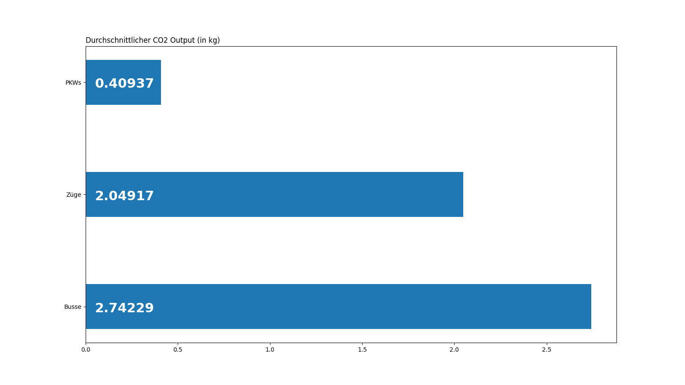
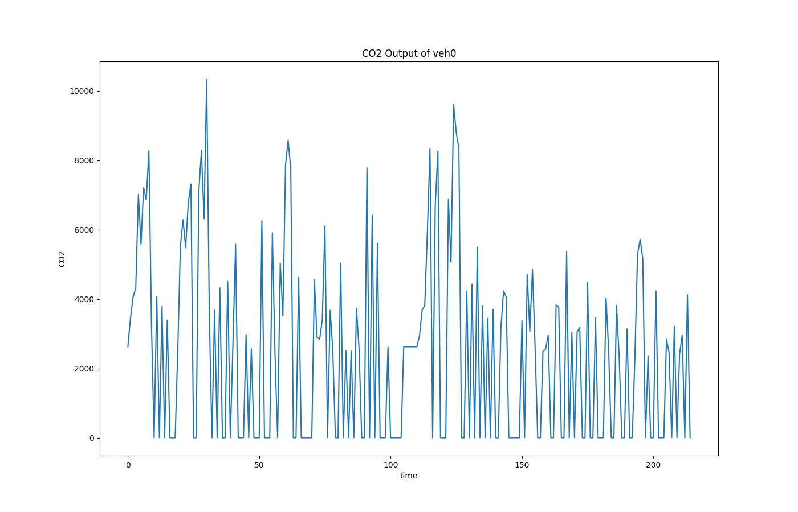
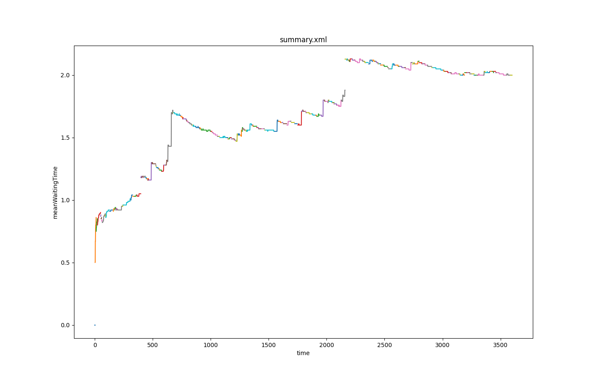
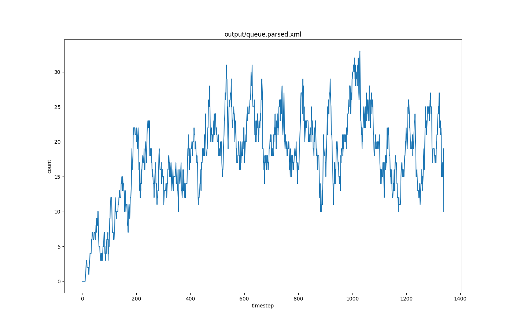

# Lüneburg Traffic Control

## Verfügbare Visualisierungen
Alle Skripts werden aus dem `lg-traffic-control` Root-Ordner ausgeführt.

### Durchschnittliche Emissions für Autotypen
Öffnet `matplotlib` Visualisierung und gibt Daten als JSON zurück.
Es werden die Emissionen aller Fahrzeuge eines Typs addiert und dann durch die Anzahl geteilt.



```bash
$ python visualization/scripts/average-emissions.py
{'PKWs': 0.40937297484822305, 'Züge': 2.0491722502222, 'Busse': 2.7422936654368986}
```

### Emissions für spezifisches Auto


```bash
$ ./visualization/scripts/emissions-for-car.sh <VEHICLE_ID>
```

### Durchschnittliche Wartezeit (Mean)


```bash
$ ./visualization/scripts/mean-waiting-time.sh
```

### Statistiken für Induction Loops
```bash
$ ./visualization/scripts/induction-loop.sh
```

### Zahl der wartenden Autos pro Zeit


```bash
$ ./visualization/scripts/queueing-lanes.sh
```

## Skripte zur Datentransformation
### Zählen der wartenden Autos (`queue.xml`)
Die `queue.xml` enthält für jeden Timestep Daten, die zeigen auf wie vielen Lanes Autos warten. Um das mit `plotXMLAttributes.py` von SUMO anzeigen zu können, werden die `<lane>` Elemente pro Step gezählt, und als Attribut in das `<data>` Element geschrieben.

Am Ende kommt die `queue.parsed.xml` dabei heraus.

```bash
$ python visualization/scripts/parse-count-of-queueing-vehicles.py
Wrote /Users/mat/Projects/lg-traffic-control/output/queue.parsed.xml

$ python $SUMO_VIZ/plotXMLAttributes.py output/queue.parsed.xml -s -x time -y meanWaitingTime --idattr loaded
```


## Verfügbare SUMO Tools
- `mpl_dump_onNet.py`
- `mpl_dump_timeline.py`
- `mpl_dump_twoAgainst.py`
- `mpl_tripinfos_twoAgainst.py`
- `plotXMLAttr.py`
- `plotXMLAttributes.py`
- `plot_csv_bars.py`
- `plot_csv_pie.py`
- `plot_csv_timeline.py`
- `plot_net_dump.py`
- `plot_net_selection.py`
- `plot_net_speeds.py`
- `plot_net_trafficLights.py`
- `plot_summary.py`
- `plot_tripinfo_distributions.py`


## `plotXMLAttributes.py` benutzen

```shell
python $SUMO_VIZ/plotXMLAttributes.py summary.xml -s -x time -y meanWaitingTime --idattr loaded
```